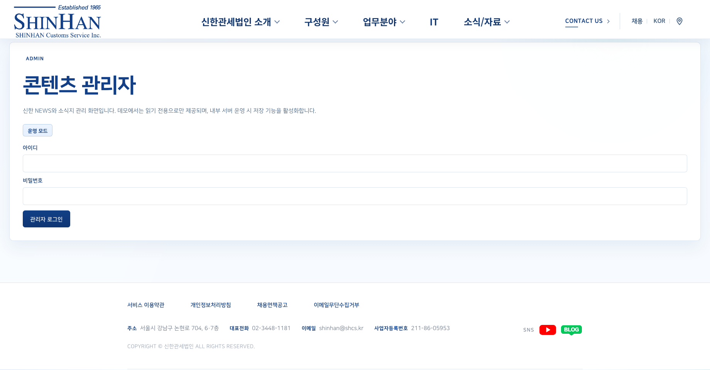
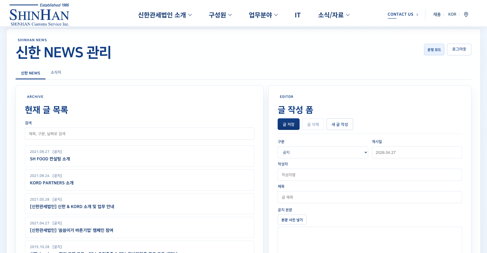
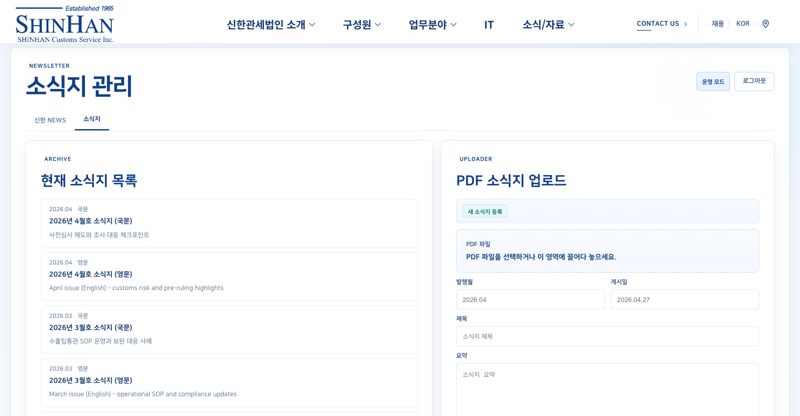

# 신한관세법인 홈페이지 운영/유지보수 인수인계서

## 1. 구동 방식

홈페이지는 프론트엔드 정적 파일과 Node API 서버를 함께 구동합니다.

| 구분 | 역할 | 구동 방식 |
| --- | --- | --- |
| 프론트엔드 | 사용자가 보는 홈페이지 화면 | `npm run build` 후 생성되는 `dist/` 제공 |
| Node API 서버 | 관리자 로그인, 신한 NEWS/소식지 API, 업로드 파일 제공, 무역 동향 API | `server/news-admin-api.ts` 실행 |

운영 서버 기준:

- OS: Rocky OS 9
- Node.js: Node.js 24
- Node API 기본 포트: `4174`
- 업로드 저장 루트: `/home/files`
- 업로드 파일명: UUID 기반 난독화 파일명

웹서버 또는 프록시에서는 아래 경로가 Node API 서버로 연결되면 됩니다.

```text
/api/admin/*
/api/news/*
/api/issue-reports
/managed-content/*
```

React Router를 사용하므로 하위 페이지 새로고침 요청에는 프론트 빌드 산출물의 `index.html`이 응답되어야 합니다.

## 2. 운영 환경변수

`VITE_` 환경변수는 프론트 빌드 시점에 반영됩니다. 값을 바꾸면 `npm run build`를 다시 실행해야 합니다.

### 2.1 정적 무역 동향 운영

외부 사이트 실시간 수집 없이 `public/issue-reports.json`을 사용하는 방식입니다.

```env
VITE_NEWS_ADMIN_MODE=enabled
VITE_ISSUE_REPORT_MODE=static-json

NEWS_ADMIN_RUNTIME_MODE=enabled
ADMIN_USERNAME=운영_관리자_ID
ADMIN_PASSWORD=운영_관리자_비밀번호
SESSION_SECRET=충분히_긴_랜덤_문자열
NEWS_ADMIN_API_PORT=4174
MANAGED_CONTENT_ROOT=/home/files

ISSUE_REPORT_RUNTIME_MODE=snapshot-only
```

### 2.2 실시간 무역 동향 API 운영

`/api/issue-reports`에서 외부 사이트를 수집하고 24시간 캐시하는 방식입니다.

```env
VITE_NEWS_ADMIN_MODE=enabled
VITE_ISSUE_REPORT_MODE=api

NEWS_ADMIN_RUNTIME_MODE=enabled
ADMIN_USERNAME=운영_관리자_ID
ADMIN_PASSWORD=운영_관리자_비밀번호
SESSION_SECRET=충분히_긴_랜덤_문자열
NEWS_ADMIN_API_PORT=4174
MANAGED_CONTENT_ROOT=/home/files

ISSUE_REPORT_RUNTIME_MODE=cache-with-refresh
```

| 변수 | 용도 |
| --- | --- |
| `VITE_NEWS_ADMIN_MODE` | 프론트 관리자 기능 활성화. 운영은 `enabled` |
| `VITE_ISSUE_REPORT_MODE` | 무역 동향 호출 방식. `static-json` 또는 `api` |
| `NEWS_ADMIN_RUNTIME_MODE` | 관리자 API 쓰기 가능 여부. 운영은 `enabled` |
| `ADMIN_USERNAME` | 관리자 로그인 ID |
| `ADMIN_PASSWORD` | 관리자 로그인 비밀번호 |
| `SESSION_SECRET` | 관리자 세션 쿠키 서명값. 기본값 사용 금지 |
| `NEWS_ADMIN_API_PORT` | Node API 서버 포트 |
| `MANAGED_CONTENT_ROOT` | 관리자 업로드 및 운영 콘텐츠 저장 루트. 운영은 `/home/files` |
| `ISSUE_REPORT_RUNTIME_MODE` | 무역 동향 서버 모드. `snapshot-only` 또는 `cache-with-refresh` |

## 3. 실행 명령어

### 3.1 의존성 설치

```bash
cd /var/www/shinhan-hompage
npm ci
```

### 3.2 프론트엔드 빌드

```bash
npm run build
```

빌드 결과는 `dist/`에 생성됩니다.

### 3.3 Node API 서버 실행

정적 무역 동향 운영:

```bash
NEWS_ADMIN_RUNTIME_MODE=enabled \
ADMIN_USERNAME=운영_관리자_ID \
ADMIN_PASSWORD=운영_관리자_비밀번호 \
SESSION_SECRET=충분히_긴_랜덤_문자열 \
NEWS_ADMIN_API_PORT=4174 \
MANAGED_CONTENT_ROOT=/home/files \
ISSUE_REPORT_RUNTIME_MODE=snapshot-only \
npm exec -- tsx server/news-admin-api.ts
```

실시간 무역 동향 API 운영:

```bash
NEWS_ADMIN_RUNTIME_MODE=enabled \
ADMIN_USERNAME=운영_관리자_ID \
ADMIN_PASSWORD=운영_관리자_비밀번호 \
SESSION_SECRET=충분히_긴_랜덤_문자열 \
NEWS_ADMIN_API_PORT=4174 \
MANAGED_CONTENT_ROOT=/home/files \
ISSUE_REPORT_RUNTIME_MODE=cache-with-refresh \
npm exec -- tsx server/news-admin-api.ts
```

정상 실행 로그:

```text
[news-admin-api] listening on http://localhost:4174
```

### 3.4 로컬 개발 실행

```bash
npm run dev
```

로컬 개발 시 프론트는 `4173`, Node API는 `4174` 포트를 사용합니다.

## 4. API 구성

Node API 서버는 다음 경로를 처리합니다.

### 4.1 관리자 세션 API

| Method | Path | 설명 |
| --- | --- | --- |
| `GET` | `/api/admin/session` | 현재 관리자 세션 확인 |
| `POST` | `/api/admin/login` | 관리자 로그인 |
| `POST` | `/api/admin/logout` | 관리자 로그아웃 |

로그인 계정은 `ADMIN_USERNAME`, `ADMIN_PASSWORD` 환경변수를 사용합니다.

### 4.2 신한 NEWS API

| Method | Path | 설명 |
| --- | --- | --- |
| `GET` | `/api/news/shinhan-news` | 공개 신한 NEWS 목록 |
| `GET` | `/api/news/shinhan-news/:newsId` | 공개 신한 NEWS 상세 |
| `GET` | `/api/admin/news/shinhan-news` | 관리자 신한 NEWS 목록 |
| `POST` | `/api/admin/news/shinhan-news` | 관리자 신한 NEWS 신규 등록 |
| `PUT` | `/api/admin/news/shinhan-news/:newsId` | 관리자 신한 NEWS 수정 |
| `DELETE` | `/api/admin/news/shinhan-news/:newsId` | 관리자 신한 NEWS 삭제 |

신규 게시글 ID와 본문 HTML 파일명은 UUID 기반으로 생성됩니다.

### 4.3 소식지 API

| Method | Path | 설명 |
| --- | --- | --- |
| `GET` | `/api/news/newsletters` | 공개 소식지 목록 |
| `GET` | `/api/news/newsletters/:newsletterId` | 공개 소식지 상세 |
| `GET` | `/api/news/newsletters/:newsletterId/preview/manifest` | 소식지 미리보기 manifest. 기존 미리보기 데이터가 있는 경우 사용 |
| `GET` | `/api/admin/news/newsletters` | 관리자 소식지 목록 |
| `POST` | `/api/admin/news/newsletters` | 관리자 소식지 신규 등록 |
| `PUT` | `/api/admin/news/newsletters/:newsletterId` | 관리자 소식지 수정 |
| `DELETE` | `/api/admin/news/newsletters/:newsletterId` | 관리자 소식지 삭제 |

새 소식지 등록 시 `originalFile` PDF만 필요합니다. 업로드 파일은 PDF만 허용합니다.

### 4.4 업로드 파일 제공

| Path | 설명 |
| --- | --- |
| `/managed-content/*` | `MANAGED_CONTENT_ROOT` 하위 업로드/관리 콘텐츠 파일 제공 |

업로드 파일은 UUID 기반 파일명으로 저장되며, 원본 파일명은 URL에 직접 노출되지 않습니다.

### 4.5 무역 동향 API

| Method | Path | 설명 |
| --- | --- | --- |
| `GET` | `/api/issue-reports` | 무역 동향 목록 |
| `GET` | `/api/issue-reports?refresh=1` | 캐시 무시 후 새로 수집 시도 |

모드별 동작:

| 설정 | 프론트 호출 | 서버 동작 |
| --- | --- | --- |
| `VITE_ISSUE_REPORT_MODE=static-json` + `ISSUE_REPORT_RUNTIME_MODE=snapshot-only` | `/issue-reports.json` | 정적 JSON 사용 |
| `VITE_ISSUE_REPORT_MODE=api` + `ISSUE_REPORT_RUNTIME_MODE=cache-with-refresh` | `/api/issue-reports` | 외부 사이트 수집 후 24시간 캐시 |

실시간 수집 대상:

- 한국관세사회: `https://krcaa.or.kr/_Document/Notify/N20601L.aspx?MenuCode=N20601`
- 한국무역협회: `https://www.kita.net/board/totalTradeNews/totalTradeNewsList.do`

외부 사이트 접근 실패, 외부망 차단, HTML 구조 변경이 있으면 기존 캐시 또는 snapshot 데이터로 fallback됩니다.

무역동향은 목록 JSON과 상세 요약 JSON을 분리해서 사용합니다.

| JSON | 용도 | 위치/경로 |
| --- | --- | --- |
| 목록 JSON | 무역동향 카드 목록 표시 | `/api/issue-reports` 또는 `/issue-reports.json` |
| 상세 요약 JSON | 카드 클릭 시 뜨는 요약 모달 내용 표시 | 각 항목의 `detailPath`, 기본값 `/trade-insights/details/{id}.json` |

목록 JSON 응답 타입:

```ts
type IssueReportApiResponse = {
  reports: IssueReport[];
  failedSources: string[];
  succeededSources: string[];
  refreshedAt?: string;
};

type IssueReport = {
  id: string;
  source: string;
  sourceEn: string;
  publishedAt: string;
  title: string;
  titleEn: string;
  summary: string;
  summaryEn: string;
  url: string;
  detailPath?: string;
  detail?: IssueReportDetail;
  status?: 'live' | 'placeholder';
  image?: string;
  tags?: string[];
};
```

목록 JSON 예시:

```json
{
  "reports": [
    {
      "id": "issue-kita-101130",
      "source": "한국무역협회",
      "sourceEn": "Korea International Trade Association",
      "publishedAt": "2026.04.27",
      "title": "트럼프 \"해상봉쇄 효과적…이란 송유관 사흘후면 내부 폭발\"",
      "titleEn": "트럼프 \"해상봉쇄 효과적…이란 송유관 사흘후면 내부 폭발\"",
      "summary": "한국무역협회 무역뉴스에서 수집한 기사입니다.",
      "summaryEn": "An article collected from the KITA trade news feed.",
      "url": "https://www.kita.net/board/totalTradeNews/totalTradeNewsDetail.do?no=101130&siteId=2",
      "detailPath": "/trade-insights/details/issue-kita-101130.json",
      "tags": ["한국무역협회"],
      "status": "live"
    }
  ],
  "failedSources": [],
  "succeededSources": ["한국관세사회", "한국무역협회"],
  "refreshedAt": "2026-04-27T09:00:00+09:00"
}
```

상세 요약 JSON 타입:

```ts
type IssueReportDetail = {
  id?: string;
  title?: string;
  source?: string;
  registeredAt?: string;
  updatedAt?: string;
  body?: string[];
  attachments?: {
    name: string;
    url: string;
  }[];
  originalUrl?: string;
};
```

상세 요약 JSON 예시:

```json
{
  "id": "issue-kita-101130",
  "source": "한국무역협회",
  "registeredAt": "2026.04.27",
  "updatedAt": "2026.04.27",
  "title": "트럼프 \"해상봉쇄 효과적…이란 송유관 사흘후면 내부 폭발\"",
  "body": [
    "미국의 해상봉쇄 발언과 이란 송유관 관련 긴장이 맞물리며 중동 지역의 에너지 공급과 해상 물류 리스크가 다시 부각된 사안입니다.",
    "원유와 석유화학 원료를 수입하거나 중동 항로를 이용하는 기업은 운임, 보험료, 납기 지연, 환율 변동 가능성을 함께 점검할 필요가 있습니다.",
    "수출입 계약을 진행 중인 경우 선적 일정, 대체 공급선, 결제 조건, 비상 재고 수준을 사전에 확인해 공급망 차질에 대비하는 것이 좋습니다."
  ],
  "attachments": [],
  "originalUrl": "https://www.kita.net/board/totalTradeNews/totalTradeNewsDetail.do?no=101130&siteId=2"
}
```

상세 요약 표시 방식:

- 카드 클릭 시 `IssueReport.detail`이 있으면 해당 값을 먼저 사용합니다.
- `detail`이 없으면 `detailPath`를 fetch합니다.
- `detailPath`가 없으면 `/trade-insights/details/{id}.json`을 기본 경로로 사용합니다.
- 상세 JSON을 불러오지 못하면 목록의 `summary` 또는 제목 기반 fallback 요약을 모달에 표시합니다.

## 5. 관리자 페이지

관리자 페이지는 신한 NEWS와 소식지를 운영자가 직접 등록/수정/삭제하기 위한 화면입니다.

| 경로 | 용도 |
| --- | --- |
| `/admin/login` | 관리자 로그인 |
| `/admin/news` | 뉴스 관리자 진입 화면 |
| `/admin/news/shinhan-news` | 신한 NEWS 및 세미나/교육 게시글 관리 |
| `/admin/news/newsletter` | 소식지 파일/미리보기 관리 |

운영 조건:

- `VITE_NEWS_ADMIN_MODE=enabled`
- `NEWS_ADMIN_RUNTIME_MODE=enabled`
- `/api/admin/*`, `/api/news/*`, `/managed-content/*` 경로가 Node API 서버로 연결되어 있어야 함

세션:

- 쿠키명: `shinhan_news_admin_session`
- 쿠키 속성: `HttpOnly`, `SameSite=Lax`
- 세션 만료: 8시간
- `SESSION_SECRET` 변경 시 기존 로그인 세션은 무효화됨

소식지 등록 조건:

- PDF 파일 필요
- Node API 업로드 제한 100MB

### 5.1 관리자 화면 예시

로그인 화면:



| 항목 | 예시 |
| --- | --- |
| 접속 경로 | `/admin/login` |
| 입력값 | 관리자 ID, 관리자 비밀번호 |
| 성공 시 이동 | `/admin/news` |
| 실패 시 | 아이디 또는 비밀번호 오류 메시지 표시 |

신한 NEWS 관리 화면:



| 항목 | 예시 |
| --- | --- |
| 접속 경로 | `/admin/news/shinhan-news` |
| 목록 영역 | 등록된 신한 NEWS/세미나 게시글 목록 |
| 게시 구분 | `FLASH`, `세미나` |
| 필수 입력 | 제목, 요약, 게시일 |
| 선택 입력 | 작성자, 본문 HTML |
| 저장 동작 | 신규 등록 또는 선택 게시글 수정 |
| 삭제 동작 | 선택 게시글 삭제 |

신한 NEWS 입력 예시:

```text
게시 구분: FLASH
게시일: 2026-05-15
제목: 관세·무역 주요 업데이트 안내
요약: 주요 관세 및 무역 이슈를 안내드립니다.
작성자: 신한관세법인
본문 HTML: <p>본문 내용을 입력합니다.</p>
```

소식지 관리 화면:



| 항목 | 예시 |
| --- | --- |
| 접속 경로 | `/admin/news/newsletter` |
| 목록 영역 | 등록된 소식지 목록 |
| 필수 입력 | 발행호, 제목, 요약, 게시일 |
| 파일 입력 | PDF 파일 |
| 신규 등록 조건 | PDF 파일 필요 |
| 수정 조건 | 기존 항목은 텍스트만 수정 가능하며, 파일 교체 시 해당 파일만 다시 업로드 |

소식지 입력 예시:

```text
발행호: 2026년 5월호
게시일: 2026-05-15
언어: 국문
제목: Zoom In Trade - 2026년 5월호
요약: 2026년 5월 주요 관세·무역 이슈를 정리한 소식지입니다.
PDF 파일: newsletter-2026-05-ko.pdf
```
